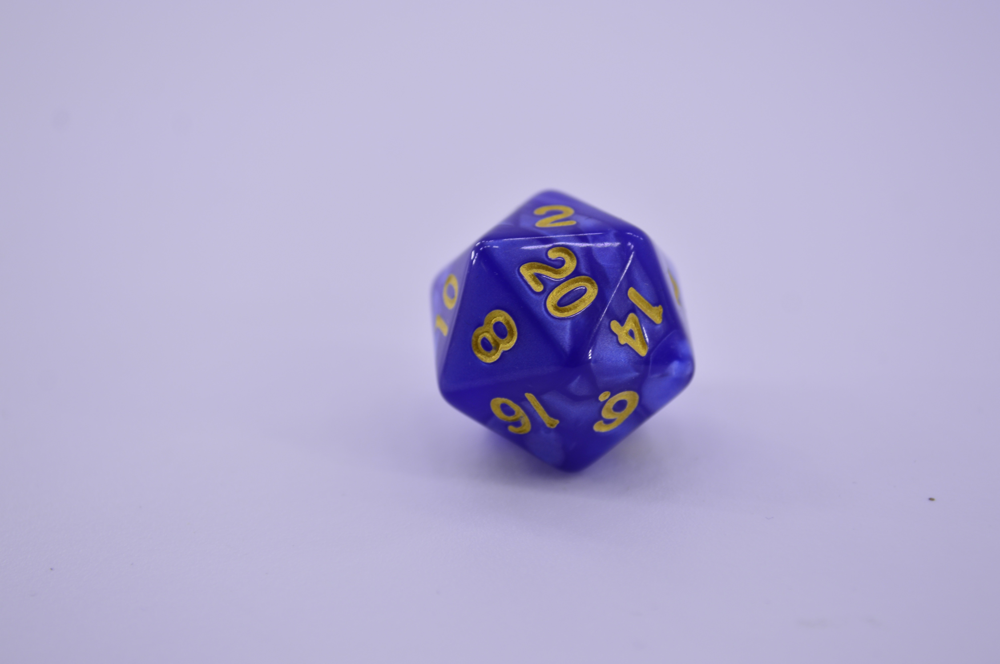

Below are the tasks we will be working through in today's workshop.
The primary goal in all of this is to go through a shakedown process for some of the core technology we will be using in this course.

Each workshop session will start with a brief introduction in the "big group" and then we will move everyone into breakout rooms in small teams.
For this week the teams will be randomly assigned.
If you are online for this session, when in a breakout room everyone should turn on their audio and video (if possible).

```{marginfigure}
**Note:** If you are online, after each person in the group has had a turn, everyone should provide constructive feedback on any audio or video difficulties encountered.
```

1.  Take turns introducing yourselves (e.g. your name, where you are currently, where you studied previously, etc.). Tell the rest of your team a boring fact about yourself. (For example, "I had corn flakes for breakfast this morning.")

```{marginfigure}
**Note:** Each participant in the team needs to have completed the "first time setup"" to be able to do the rest of the workshop.
    Team members who have already got themselves setup can move on and include the remaining members once they are ready.
```

2.  Before the session, you should have completed the [Getting to know you survey](https://forms.office.com/Pages/ResponsePage.aspx?id=sAafLmkWiUWHiRCgaTTcYdffF13VDSBAsmaFgj3BcYtUREVZQUVSWjY2UlZDTVdMWjM3NzI3VzVQUi4u) and set up accounts on:

    -   GitHub
    -   RStudio Cloud
    -   Piazza

    If you haven't, make sure you do the first two now, and link the GitHub and RStudio Cloud accounts.
    Instructions on how to do this can be found on the [Setup & Troubleshooting](https://ids-s1-21.netlify.app/troubleshoot/) page on the course website.

    If you encounter any issue you can ask for help by raising your hand (in person) or pressing the **Ask for help** button (within Zoom).

We're now going to start working with R code.
Don't worry today if you don't understand what every line of code does---the purpose of this workshop is to give you experience working with RStudio Cloud, and pushing, committing and pulling from/to GitHub.
Mostly you'll just be replacing text in a data frame in an R Markdown file in your team's repository.

Lets start by making a data frame.
Normally we'll load these from outside R, but you can also create them within R as well, using a function called "`tibble`".
This isn't something you'll want to do except for really simple data frames---like the one we're about to make!

The data frame we'll make will contain three variables: the name of each member of the team, the outcome of rolling a die for each member, and a colour for each member.
We're going to fill in the data frame with some information.

The entries for the first column, for someone called Jamie, are already filled in for you.
Leave these in place.

3.  Decide in what order you will work on the task (i.e. who is going first, second, third).

Now, in turn, each member of the team should perform the following.

4.  Using the Git tab in the top-right, **pull** your team's repository from GitHub into RStudio Cloud.
    (It will contain your team name in the name of the repository).

5.  Add your name into the first unused space in the `names` vector (i.e. the first person replaces the text `Name 1`, the second person replaces the text `Name 2`, and the third person replaces the text `Name 3`; if you have four or more people on your team the fourth person will have to add a completely new entry to the vector).

```{r die, echo = FALSE, fig.margin = T}

```

6.  Roll a 20-sided die.
    (You can do this within R by typing `sample(20, 1)` into the console---or just roll a die, if you happen to have one with you!)
    Enter the result into the `nums` vector, replacing the next `NA` (or extending the vector, if you are the fourth or later member of your team).
    **Do not** enclose it in quotes!

7.  Pick a colour, and enter it into the `colours` vector, like you did with your name.
    If you want to see a list of available colours, type `colours()` (or `colors()`) into the console, and press Enter.

8.  Put one of your hobbies in the `hobbies` vector, like you did with your name.
    This can be anything you like, but make sure it has quotes around it!

9.  Pull again (in case anyone has made changes since the last time you pulled), commit (using a message like "Added Jamie's entries") and push, using the Git tab at the top-right.
    Make sure your commit messages say which exercise you have completed.

If everyone in the team has completed Exercises 4--9, move on to the next exercise.
Otherwise, the next member of your team should go back to Exercise 4.

10. "Uncomment" the three lines that look like the code below (that is, remove the `#` symbol from the beginning, so that R knows to run them as lines of code). Then press the "Knit" button. You should see that a plot has appeared in your R Markdown document, just after the code.

```{r colplot, echo = T}
# p <- ggplot(team_data, aes(x = name, y = die_roll)) +
#   geom_col(fill = team_data$colour)
# p
```

11. What does the plot show?
    Type your answer into the space provided in your team's R Markdown document.

12. Uncomment the code corresponding to this exercise, and press the "Knit" button.
    What's changed about this plot?

13. Replace `Insert text here` each time it appears with sensible choices of text.
    Press the "Knit" button.

14. Have a look at the plot on the knitted R Markdown document for "Exercise 14".
    (Re-knit the document if you need to.) This plot probably isn't a good data visualisation, unless one of your team also has photography as a hobby.
    In fact, suppose you had a data frame that extended to everyone taking this course.
    The data visualisation produced by this method would probably be even worse at conveying information.
    Why?
    Can you think of any way to display these data nicely?
    (You do not need to write code to do this!)

That's the end of this lab!
Remember, this lab isn't marked.
